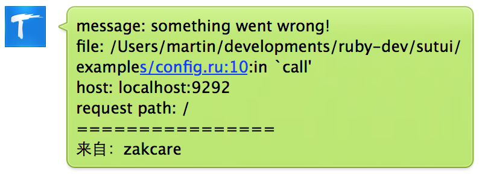

速推SDK介绍
===

**速推**是基于微信公众号的消息推送中心及控制台。可以帮助开发者安全快速地实现例如服务器或业务异常告警，远程控制服务器等需求。

本gem实现对速推API的Ruby封装，关于速推的更多介绍、使用方法以及接口集成，请直接关注速推官方公众号“sutui”即可。

### 使用示例
使用速推SDK前必须先从速推公众号申请开发者资格，以获得接口调用的`api_key`以及`api_secret`，具体方法请根据公众号提示进行。

```ruby
require 'sutui'

api_key = 'api_key_string'
api_secret = 'api_secret_string'

# 初始化SDK
sutui = Sutui::SutuiSDK.new api_key, api_secret

# 查看当前所有channel列表
sutui.channels
# => [{"channel_id"=>12, "name"=>"channel 1"}, {"channel_id"=>15, "name"=>"channel 2"}]

# 创建新的channel
sutui.create_channel 'channel 3'
# => {"channel_id"=>16}

# 删除创建的channel
sutui.remove_channel 16
# => {"channel_id"=>16}

# 向指定channel推送文本消息
sutui.notify 12, 'text', 'Text Message'
# => {"message"=>"ok", "errono"=>0}

# 在指定channel下创建命令
sutui.create_command 12, 'rs', 'http://example.com/commands/rs'
# => {"command_id"=>7}

# 列举channel下所有命令
sutui.commands 12
# => {"12"=>[{"url"=>"http://example.com/commands/rs", "command"=>"rs", "description"=>"", "command_id"=>7}]}

# 删除指定command
sutui.remove_command 7
# => {"command_id"=>7}
```
以上为常见方法，其他更多支持的方法，请直接参考本[SDK源代码](lib/sutui/sutui_sdk.rb)。

### 注意事项
速推API接口需要通过签名字符串参数进行访问授权，如果授权验证失败，服务器将会返回403 Forbidden 响应，SDK也会因此抛出`Sutui::AuthenticationError`异常，开发者在使用过程中需要注意处理异常并且排查错误。

### TODO
1. 将此gem打包上传到[rubygems网站](https://rubygems.org)，方便开发者直接通过`bundle install`安装。
2. SDK中的以下方法工作不正常，需要进行新的测试以及修复：
  1. `subscribe`
  2. `subscriptions`
  3. `update_command`

## Middleware的集成
本gem在SDK的实现上，提供Rack中间件的实现，理论上，开发者可以在基于Rack的应用程序中方便集成该中间件，具体的使用方法可以参照本gem中提供的[简单示例](lib/examples/config.fu)。
开发者可以下载本代码，然后在项目根目录下执行以下示例命令运行示例程序（**注意**：记得替换API_KEY, API_SECRET以及CHANNEL_ID参数）：
```sh
API_KEY=your_api_key API_SECRET=your_api_secret CHANNEL_ID=1 rackup -Ilib examples/config.ru
```

### Ruby on Rails中使用
```ruby
# config/enviroments/production.rb
config.middleware.use Sutui::Rack::ExceptionNotification, sutui: {
  api_key: 'your_api_key_here',
  api_secret: 'your_api_secret_here',
  channel_id: 1    # change to your channel_id
}
```

### 运行效果示例：<br>

